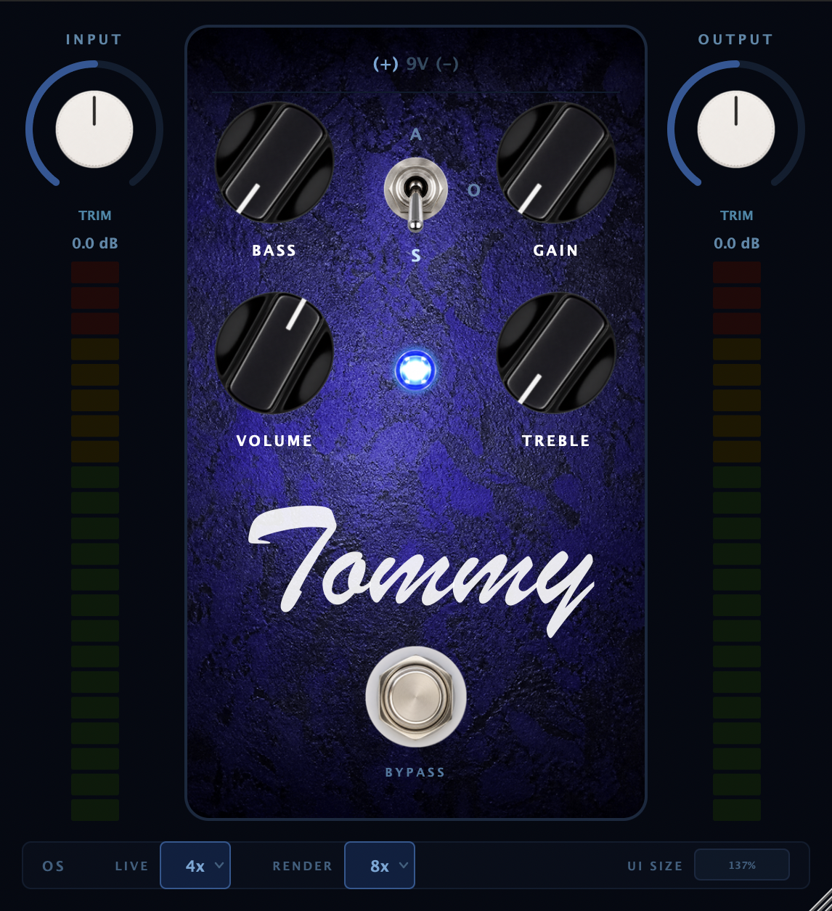

# Tommy

Tommy is an overdrive plugin (AU and VST3) modelled on the classic "transparent overdrive"
pedal circuit. Rather than capturing a handful of fixed gain settings, Tommy simulates the actual 
analog circuit — drive stage,diode clipper, passive tone network, and output buffer — sample by 
sample, so everycontrol behaves the way the real pedal's electronics would at any setting in between.

> Tommy is an original implementation built from circuit analysis and is not affiliated
> with or endorsed by any pedal manufacturer.



## Overview

Under the hood, Tommy's signal path is built as a [Wave Digital Filter](https://en.wikipedia.org/wiki/Wave_digital_filter)
(WDF) network using [`chowdsp_wdf`](https://github.com/Chowdhury-DSP/chowdsp_wdf). Every 
resistor, capacitor, and diode in the original circuit has a corresponding WDF element 
with the real component's value; the nonlinear clipping diodes are solved with 
Newton-Raphson iteration rather than a curve-fit approximation. The resultresponds to 
the interaction between controls the way the analog circuit does — turningup Bass 
changes how Gain behaves, because on the real pedal they share the same feedback
network, and that coupling is modelled directly rather than faked with two independent
EQ curves.

## Features

- **Circuit-accurate drive stage** — Bass and Gain share a single coupled feedback
  network, modelled as one WDF tree (not two independent controls), matching the
  real pedal's interactive behavior
- **Three-position clipping switch** (Symmetrical / Open / Asymmetrical) — switches
  between three precomputed diode network topologies (two antiparallel pairs, one
  pair, or a single diode), each solved with per-component 1N4148 Shockley diode parameters
- **Interactive passive treble network** — modelled as a coupled RC filter rather than
  a generic shelving EQ
- **Per-polarity diode mismatch modelling** — reproduces the subtle even-harmonic
  content real diode tolerances add to the clipped signal, which a "perfectly matched"
  diode pair can't produce on its own
- **Selectable supply voltage** (9V / 12V / 18V) — raises op-amp rail headroom exactly
  as it would on the real pedal's power jack, without touching diode clipping thresholds
- **Oversampling with antiderivative anti-aliasing (ADAA)** — 1x/2x/4x/8x, with
  independent factors for live playback and offline rendering, applied across the
  clipping stage and the downstream linear stages so the top octave stays accurate
  at any factor
- **Calibrated I/O** — input and output trim with VU-style metering, calibrated to
  -12 dBu internal headroom
- **True bypass** with a short crossfade to avoid clicks
- **Resizable UI** from 50% to 250%, with the scale remembered per session

## Circuit accuracy

Tommy's response was validated against real-pedal reamp captures rather than tuned by
ear alone:

- Bass and treble frequency response match the real pedal's cut curves within roughly
  ±0.5 dB across the sweep
- Second-harmonic level at high drive matches the real pedal within ~1 dB across all
  three clipping modes (including the even-harmonic asymmetry mentioned above, which
  a symmetric diode model can't reproduce)
- Top-octave response (the part most sensitive to digital discretization error) is
  within ±2 dB of the real pedal at the default oversampling factor — extending the
  oversampled region to include the linear stages after the clipper closed most of a
  several-dB gap that a 1x-only fix couldn't

None of this is neural-net or sample-based modelling — every stage is an analytic
circuit solve, so the plugin's behavior generalizes to settings and signal levels that
were never explicitly captured.

## Controls

| Control | Description |
|---|---|
| Bass | Low end into the drive stage (shares a feedback network with Gain) |
| Gain | Drive amount / clipping stage input level |
| Treble | High-frequency cut after the clipping stage |
| Volume | Output level |
| Clipping switch (Symmetrical / Open / Asymmetrical) | Selects the diode clipping topology |
| Supply voltage (9V / 12V / 18V) | Op-amp rail headroom; diode thresholds unchanged |
| Input Trim / Output Trim | ±12 dB trims with VU metering, for level matching |
| Oversampling (live / render) | 1x / 2x / 4x / 8x, independent factors for playback vs. export |
| Bypass | True bypass with crossfade |

## Where to find things

```
src/
  PluginProcessor.{h,cpp}    Plugin entry point, parameter layout, processBlock
  PluginEditor.{h,cpp}       Top-level UI layout
  dsp/                       The WDF circuit model, one file per circuit stage
    InputBuffer.h              Input network
    Stage1.h                   Drive stage (IC1_A) + SW1 diode clipping
    ClippingOversampler.h      Oversampling wrapper around Stage1
    TrebleNetwork.h            Passive treble filter
    Stage2.h                   Output buffer stage (IC1_B)
    Prewarp.h                  Bilinear-warp correction for the tone/feedback caps
    TommyDSP.h                 Wires the stages into the full signal chain
  ui/                        Custom LookAndFeel and UI components (image-based controls)
  utils/
    TaperUtils.h                Potentiometer taper curves

tests/                      Per-stage validation executables (frequency response,
                             clipping behavior, aliasing reduction, full-chain checks)
analysis/                   Offline render tool + Python scripts used to compare the
                             plugin's output against real-pedal reamp captures
schematics/                 Source schematics the circuit model is built from

.claude/rules/               Detailed circuit/DSP/architecture/UI/build references —
                             read circuit.md if you want the full component-by-component
                             schematic breakdown
CLAUDE.md                    Project status and build-step log
```

## Installing a release build

Prebuilt zips (one per platform: macOS, Windows, Linux) are published on the
[Releases page](https://github.com/tehguitarist/Tommy/releases). Each release is built and
packaged automatically by [GitHub Actions](.github/workflows/release.yml), but only ever on
a manual trigger — nothing publishes itself on every push.

> **macOS note:** release zips are currently **unsigned** (Apple Developer ID signing and
> notarization are planned for a future release). Gatekeeper will warn on first launch —
> right-click the plugin and choose "Open", or allow it in System Settings → Privacy & Security.

## Building

Requires CMake 3.15+, a C++17 compiler, and the JUCE, chowdsp_wdf, and xsimd submodules
(xsimd accelerates the circuit's matrix math). Builds as an Audio Unit + VST3 on macOS, and
VST3 on Windows/Linux.

```bash
git clone --recurse-submodules https://github.com/tehguitarist/Tommy
cd Tommy
cmake -B build -DCMAKE_BUILD_TYPE=Release
cmake --build build --target Tommy_AU    # macOS only
cmake --build build --target Tommy_VST3  # all platforms
```

The AU is copied into `~/Library/Audio/Plug-Ins/Components/` automatically after the
build. To validate it without opening a DAW:

```bash
auval -v aufx Tom1 LeP1
```

### Running the test suite

Each circuit stage has a standalone validation executable that checks it against an
analytic transfer function or known circuit behavior. They're registered with CTest, so
the whole suite runs as one pass/fail gate (this is also what CI runs on every push/PR):

```bash
cmake --build build
ctest --test-dir build --output-on-failure
```

## Status

Core DSP, UI, and calibration are complete and the plugin passes `auval`. See
[CLAUDE.md](CLAUDE.md) for the detailed build-step log and what (if anything) is
still open.

## License

Tommy is licensed under the [GNU Affero General Public License v3.0](LICENSE) (AGPLv3).

## Credits

Built by Leigh Pierce, using:

- [JUCE](https://juce.com/) — plugin framework and UI toolkit
- [chowdsp_wdf](https://github.com/Chowdhury-DSP/chowdsp_wdf) — Wave Digital Filter
  modelling library
- [xsimd](https://github.com/xtensor-stack/xsimd) — SIMD acceleration for the circuit's
  matrix math

Thanks to the Chowdhury DSP and JUCE communities for the tools that made a
circuit-accurate approach practical to build solo.
